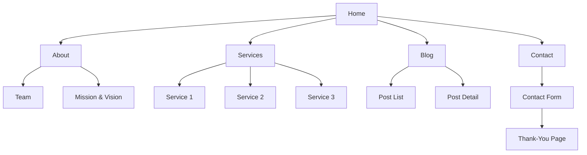

# Website Flow and Contact Details

---

## 📖 Overview
This document outlines the **user navigation flow**, **page hierarchy**, and **contact handling** for the website. It focuses on the **experience** rather than any technical stack.

---

## 🗺️ Site Map (High‑Level)

---

## 🚀 Primary User Flow
1. **Landing on Home** – First impression with a hero section, clear CTA (e.g., "Learn More" or "Get in Touch").
2. **Navigate via Header** – Sticky navigation bar with links to **About**, **Services**, **Blog**, **Contact**.
3. **Explore Content** – Users can dive into service details or read blog posts. Each content page includes a **secondary CTA** encouraging contact.
4. **Reach Contact** – Clicking the **Contact** link or a CTA scrolls or routes to the contact page.
5. **Submit Contact Form** – Users fill out the form, receive immediate validation feedback, and on success see a **Thank‑You** page.
6. **Follow‑up** – Optional: After submission, an auto‑email is sent to the user and the internal team.

---

## ✉️ Contact Page Details
### Layout
- **Hero Section** – Brief invitation, supportive tagline, and a standout **"Contact Us"** button.
- **Form Area** – Center‑aligned, responsive, with the following fields:
  - **Name** (required, text)
  - **Email** (required, email format, real‑time validation)
  - **Phone** (optional, numeric, format hint)
  - **Subject** (required, dropdown with common topics)
  - **Message** (required, multiline textarea)
- **Map / Location** – Embedded Google Map or static SVG showing office location.
- **Contact Info** – Phone number, email address, and physical address displayed alongside the form.

### Validation & UX
- Inline validation instantly shows errors (e.g., "Please enter a valid email").
- Submit button shows a loading spinner while processing.
- Success state displays a **Thank‑You** panel with:
  - Confirmation message.
  - Expected response time (e.g., "We’ll get back within 24 hours").
  - Optional secondary CTA – "Return Home" or "View Our Services".

### Accessibility
- All form controls have associated `<label>` elements.
- Keyboard navigation works seamlessly.
- ARIA live region announces validation messages to screen readers.

---

## 📱 Responsive Behavior
| Breakpoint | Layout Adjustments |
|-----------|-------------------|
| **≥1200 px** (desktop) | Two‑column layout on the contact page: form on the left, map/info on the right. Sticky header with full menu.
| **768‑1199 px** (tablet) | Stacked layout: form on top, map/info below. Hamburger menu for navigation.
| **<768 px** (mobile) | Full‑width single column. Footer collapses into accordions. Larger touch targets for form fields.

---

## 🛎️ Post‑Submission Flow (Backend‑Agnostic)
1. **Form data** is sent via HTTPS `POST` to an endpoint.
2. **Server validates** data again (never rely solely on client‑side validation).
3. **Email Notification** – An email is dispatched to the support team containing the submission details.
4. **Auto‑Reply** – An acknowledgment email is sent to the user (optional).
5. **Data Storage** – Submission can be logged to a database or a CRM (implementation‑specific, not covered here).

---

## 📌 Additional Details
- **Footer** – Persistent across all pages, includes quick links, social icons, and a miniature contact snippet.
- **Breadcrumbs** – Present on deeper pages (e.g., Service Detail, Blog Post) to aid navigation.
- **Call‑to‑Action Consistency** – Every page ends with a subtle CTA directing users toward the contact form.
- **Micro‑Interactions** – Hover effects on buttons, subtle fade‑in of sections on scroll, and smooth scrolling to the contact form when linked from other pages.

---

*This document serves as a reference for designers, developers, and content creators to ensure a cohesive, premium user experience.*
